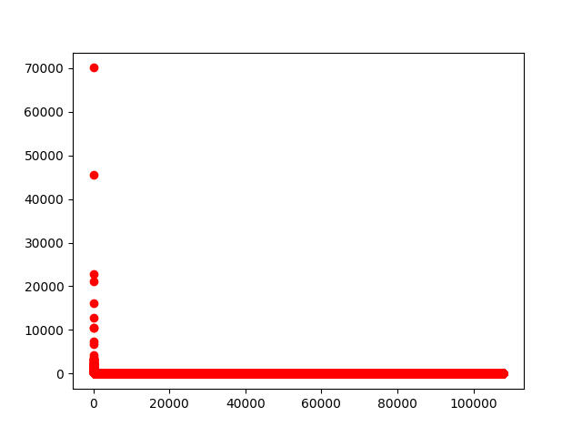

## Regular expressions
```
import re  
s = 'Привет мир!'  
re.search(r'м[а-я]+', s)  
```
Output: <_sre.SRE_Match object; span=(7, 10), match='мир'>  
```
m = re.search(r'м[а-я]+', s)  
m.group()
```
Output: 'мир'  
```
m.span()
```
Output: (7,10)  
```
re.sub('[а-я]', 'x', s)
```
Output: 'Пxxxxx xxx!'  

## Libraries and modules in Python  

### matplotlib  

```
$ head ranks.txt  
70048   ,  
45571   .  
22727   в  
21243   и  
16177   "  
12898   -  
10531   на  
10434   не  
7464    что  
6833    с  
```   
plot.py:
```
import sys
from matplotlib import pyplot as plt

x = []
y = []

fd = open('ranks.txt', 'r', encoding='utf-8')
for line_number, line in enumerate(fd):
    line = line.strip()
    if line == '':
        continue
	
    row = line_number, line.split('\t')
    #print(row)
    x.append(int(row[0]))
    y.append(int(row[1][0]))

plt.plot(x, y, 'ro')
plt.show()
```
Output:  
  

### ElementTree  

Code:
```
$ wget "http://depts.washington.edu/uwcl/odin/isl-ex.xml"
tree = ET.parse('isl-ex.xml')
root = tree.getroot()
print(root.tag)
```
Output: xigt-corpus  

```
>>> for tier in root.findall('.//tier'):
...         if tier.attrib['id'] == 'n':
...                 for item in tier.findall('.//item'):
...                         print(item.text)
```
Output: 
__(Þau) Jón og María eru vinir.__  
__they.NEUT Jón og María are friends__  
__Jón and María are friends.__  

Saved into gloss.py  

*How would you get just the Icelandic line and the gloss line ?*
```
for tier in root.findall('.//tier'):
    if tier.attrib['id'] == 'n':
        for item in tier.findall('.//item'):
            if item.attrib['tag'] != 'T':
                print(item.text)
```  
Output:  
__(Þau) Jón og María eru vinir.__  
__they.NEUT Jón og María are friends__  

### scikit learn  

```
$ python3 pronunciation.py
```  
__Accuracy:__ 0.9955177050649933    

*An exercise for the reader is to split the data in two randomly and train on one half and test on the other half.*  
*What kind of accuracy do you get ?*  
*What kind of errors does the classifier make ?*  
*How do you think you might be able to improve on the accuracy ?*  
See pronunciation.py  
Output:  
- 0 ('#церковь#', '[ˈt͡sɛrkəfʲ]', 1)  
- 0 ('#бровь#', '[brofʲ]', 1)  
- 0 ('#нелюбовь#', '[nʲɪlʲʊˈbofʲ]', 1)  
0.9973118279569892
Accuracy is a bit hier, now such words as __любовь, кровь, морковь__ are predicted correctly, 
but there are still mistakes when preceding character is a labial vowel and the following is a soft sign.  
So these features should be added to the feature vector.  

## Screenscraping  

See wiktionary.py  
*I leave the second problem (dealing with the окончание) as an exercise for the reader.*
```
stem = text.split(':')[1].split(';')[0].strip('.')
```  
Outputs:  
 -страх-        3a      strax  
 -дерев-        1a^     ˈdʲerʲɪvə  
 
## Unigram tagger  

The code is in tagger.py  
```
$ python3 tagger.py input.conllu model.tsv
```
The output is in output.conllu   
- How accurate is the tagger ?  
Everything were predicted right except words with incorrect automatic lemmatization. Such as __детей__ and __курами__.
- How could you improve performance without incorporating context  
-- using Python string functions ?  lowercase??  
-- using regular expressions ?  idk extract smh just the root and match w/dictionary  
-- using screen scraping ?  get pos-tag from dictionary and merge the paradigm  
- Could you store other single-word features in your unigram model ? Which features might you like to store ?  
I guess almost any morphological features.


