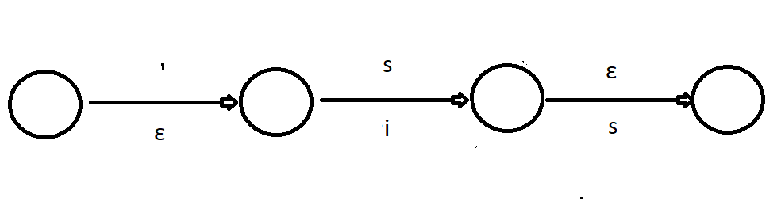

<html>
<body>
<br>
1.<br> <br>
<br>
<br>2.
 I suppose it will expand "'s" when it actually represents the possessive form. 
Probably we want to change "s" into "is" only in the cases where "s" is a contraction for "is" like in the phrase
"he's smart". In this case we can make a morphological constraint that says that this rule shuld be implemeted when
the word is not followed by a noun. 
<br>
<br>
3. a), b)
<br>
4.
<br>
a) won't work as we will get a different output from what we were supposed to, like in the example given in the 
practical page 
'''
a:b <=> c _ ;
b:d <=> c _ ;
'''
will turn acaca into acbcb instead of acdcd
<br>
b) works by adding some new defenitions to make our rules easier to state
<br>
<br>
c)doesn't make sense to subtract from smth specific smth general but maybe I don't understand correctly
<br>
<br>
d)works in cases where the rules are in conflict with each other like:
'''
k:v <=> u _ u;
k:ε <=> V _ V;
'''
we could rewrite it into 
'''
k:v <=> u _ u;
k:ε | k:v <= V _ V	
'''
<br>
<br>
 5. 
 
 ```
import sys
import re

SOFT = ['ch', 'sh', 'tz', 's', 'x']

for line in sys.stdin.readlines():
	if re.search(e for e in SOFT +'<PL>', line):
		line = line.replace('<PL>','es')
	else:
  line = line.replace('<PL>','s')
	print(line)
 ```
<br>
<br>
</body>
<html>

