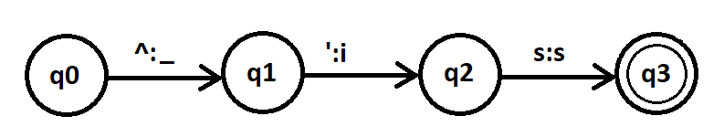
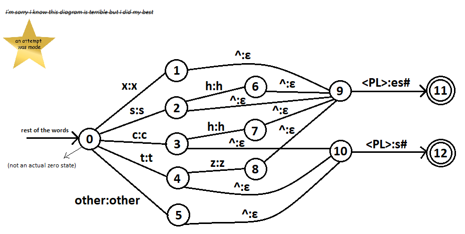

<p>1.<br>
</p>

<p>2. When "'s" is used in posessive case (<i>Julia's response</i>).<br>
I can incorporate context morphological rule that states that "'s" should never
correspond to "is" when followed by a noun, because phrases like <i>"Julia is dancing",
"Julia is a cat", "Julia is (not so) smart"</i>, when it's followed by verb, article, adjective or negation,
are okay.</p>

<p>3. b, c.</p>

<p>4. b, d.<br>
<i>a) Using the rewrite rules without changes</i><br>
<b>Contrexample</b>: Won't work because parallel rules are applied at the same time. There is no order like in rewrite rules.<br>
a → b / c _ ;<br>
b → d / c _ ;<br>
acaca → acbcb → acdcd<br>
vs.<br>
a:b <=> c _ ;<br>
b:d <=> c _ ;<br>
acaca → acbcb<br>
<i>b) Underspecifying the rewrite rules</i><br>
<i>and d) Subtracting the context of the more specific rule from the more general</i><br>
<b>Example:</b><br>
(a)k:v <=> u _ u C [#: | C]<br>
(b)k:[epsilon] <= V _ V C [#: | C]<br>
a and b are in conflict without ordering, but we can change b to c:<br>
k:[epsilon] | k:v <= V _ V C [#: | C]<br>

<i>c) Subtracting the context of the more general rule from the more specific</i><br>
<b>Contrexample:</b><br>
(a) N -> m / _ p; elsewhere, n.<br>
(b)	p -> m / m _<br>
kaNpan can't be realized as kampton

<p>5.<br>
</p>
Python implementation <b>(2-5_pl.py)</b>:

```python 
import sys
import re

soft = ['ch', 'sh', 'tz', 's', 'x']

for line in sys.stdin.readlines():
	if re.search(str([i for i in soft])+'<PL>', line):
		line = line.replace('<PL>','es')
		print(line)
	else:
		line = line.replace('<PL>','s')
		print(line)
```