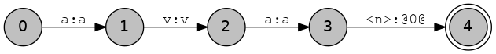
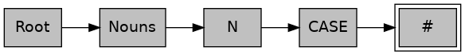
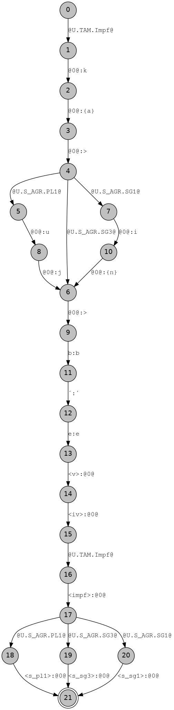
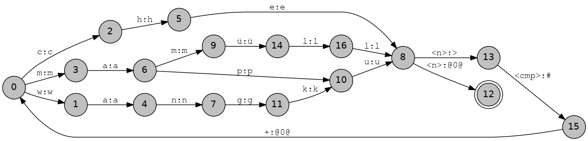

# Modelling morphology with finite-state transducers using HFST

## Why make a finite-state transducer?

Finite-state transducers are amazing, they allow for both analysis and generation in a single model, you can use them for testing your morphological rules and find errors in how you analyse morphology.

You might be really into neural networks because you can just take some manually annotated data and produce a wonderful model with a lot of weights that gets really high F-score. But where does that data come from and how can you evaluate your model? Well, one way to generate lots of data instead of manually annotating it — think of the poor annotators ;( — is to build a finite-state model.

## A simple lexical transducer
You might be really into neural networks because you can just take some manually annotated data and produce a wonderful model with a lot of weights that gets really high F-score. But where does that data come from and how can you evaluate your model? Well, one way to generate lots of data instead of manually annotating it — think of the poor annotators ;( — is to build a finite-state model.

The most basic lexical transducer can be made with a `Multichar_Symbols` definition and a `Root` lexicon. These are two parts that are necessary for the transducer to compile. In the `Multichar_Symbols` section we define our grammatical tags that we are going to use, and we can use the `Root` lexicon to store a few lexemes. For example,

```
Multichar_Symbols

%<n%>                ! Nombre

LEXICON Root

ava%<n%>:ava # ; ! "raza, gente"
```

 In `Multichar_Symbols` we define a grammatical tag for noun and leave a comment (the part after the `!` symbol) to indicate what the symbol stands for. Tags can take any form, but my preference is for grammatical tags to appear between less than `<` and greater than `>` symbols, which need to be escaped with the symbol `%`. The `Multichar_Symbols` section ends when the first `LEXICON` appears. Other things that go in the `Multichar_Symbols` section include archiphonemes and helper symbols for the phonological rules (often called "diacritic symbols" in the literature).

The remainder of the transducer is made up of a set of "continuation lexica", these have unique names and are prefixed with the line "`LEXICON`". These lexica are read from Root and may call each other, including recursively. There is a special lexicon which is pre-defined and called "`#`" which indicates the end of the string.

The remainder of the transducer is made up of a set of "continuation lexica", these have unique names and there are two sides which are separated by a colon, :. These two sides may be referred to in different ways in the literature. Get used to working out which side is being referred to. This is complicated by the fact that some ways of referring to them are ambiguous:

*    left side, upper side, lexical side, lower side
*    right side, lower side, morphotactic side, upper side, surface side

I will try and be consistent and use the following:

*    lexical form/side, to refer to the lemma + tags
*    morphotactic form/side, to refer to the stem + suffixes
*    surface form/side, to refer to the final surface form

A pair of lexical/morphotactic strings should be followed by an obligatory continuation class, which may be `#` for end of string and then a semicolon, `;`. Comments may be included anywhere in the file by using a `!` symbol which applies to the end of the line.

So, now we've gone through that explanation, let's try compiling our lexicon file. You should open a new file with your favourite text editor and type in the code above. Save it as `grn.lexc` in a new directory and navigate there on the command line. Give the following command: 

```
$ hfst-lexc grn.lexc -o grn.lexc.hfst
```

This command says to use the HFST lexc compiler to convert the lexicon file, `grn.lexc` into a binary representation and store the output in `grn.lexc.hfst`. The command should give the following output:
```
hfst-lexc: warning: Defaulting to OpenFst tropical type
Root...
```

 and you should get a file called `grn.lexc.hfst`: 

```bash
$ ls -l grn.lexc.hfst 
-rw-r--r-- 1 fran fran 433 des  3 19:57 grn.lexc.hfst
```

As we didn't tell the compiler what kind of transducer we wanted to produce it has defaulted to OpenFst (a backend transducer library) and the tropical weight transducer (a way of distributing weights over an FST). 

There are a few things we need to get used to doing with the lexical transducer. The first is printing it out, we can do this in a couple of ways. First we can print out the strings that the transducer covers, using the `hfst-fst2strings` command, 

```bash
$ hfst-fst2strings grn.lexc.hfst 
ava<n>:ava
```

Our fairly limited transducer only recognises one string pair so far. We can also print out the FST that was produced: 

```bash
$ hfst-fst2txt grn.lexc.hfst
0	1	a	a	0.000000
1	2	v	v	0.000000
2	3	a	a	0.000000
3	4	<n>	@0@	0.000000
4	0.000000
```

Here the first column is the input state, the second column is the output state, the third and fourth columns are the input and output symbols respectively and the fifth column is the weight of the transition. The `@0@` is the default symbol for *epsilon* — that is no input/output and final states have only two columns the first being the state id and the second being the weight.

As you can imagine it is fairly easy to write a program to turn this tabular format into a format appropriate for visualising with GraphViz or some other graph visualisation library. Feel free to write your own visualisation method using your preferred library, or use this one I prepared earlier: 

```python
import sys

print('digraph G { rankdir="LR"')
print('node [fontname="Tahoma",shape=circle,fontsize=14,fixedsize=true,fillcolor="grey",style=filled]')
print('edge [fontname="FreeMono",fontsize=14]')
for line in sys.stdin.readlines():
        line = line.strip()
        row = line.split('\t')
        if len(row) >= 4:
                print('%s [label="%s"];' % (row[0], row[0]))
                print('%s -> %s [label="%s:%s"];' % (row[0], row[1], row[2], row[3]))
        elif len(row) == 2: # Final state
                print('%s [label="%s",shape=doublecircle];' % (row[0], row[0]))

print('}')
```
You can make a new text file in your text editor, paste in the script and save it in a file called `att2dot.py`. Then run it as follows: 

```bash
$ hfst-fst2txt grn.lexc.hfst | python3 att2dot.py  | dot -Tpng -o grn.lexc.png
```
You should get an output file that looks something like: 



Being able to visualise the transducer and see which strings it accepts is vital for being able to debug your code. Now, go back to your `grn.lexc` file and add some more stems, for example *óga* 'house', *irũ* "friend" and *apyka* "chair". Then recompile and rerun the other steps up to visualisation. 

## Morphotactics 

The morphotactics of a language is the way that morphemes combine to make surface forms. If you are one of those people that believes in morphemes then you probably also believe that they can be combined and that there are language-specific constraints on their combination, for example in Spanish if the plural morpheme for nouns is *-s* then applying it to a stem should result in *casas* and not **scasa**. 

## Continuation classes

In finite-state transducers the the morphotactic ordering constraints are implemented by means of continuation classes. These are sets of suffixes which can appear in the same position. For example let's suppose we want to add the genitive case suffix *-gui* in Guaraní. 

```
Multichar_Symbols

%>                   ! Frontera de morfema
%<n%>                ! Nombre
%<gen%>              ! Genitivo
%<loc%>              ! Locativo

LEXICON Root

Nouns ;

LEXICON N

%<n%>: CASE ;

LEXICON CASE

%<gen%>:%>gui #; ! "de"
# ;

LEXICON Nouns

ava:ava N ; ! "raza, gente"
óga:óga N ; ! "casa"
irũ:irũ N ; ! "amigo"
apyka:apyka N ; ! "silla"

```

 This lexc file defines three new continuation classes:

- `Nouns`: This is used for our list of stems, usually there is one continuation class per major lexical category (part of speech)
- `N`: This is our continuation lexicon for nouns, here we give a part of speech tag and pointers to the set of suffixes that can attach directly to the stem.
- `CASE`: Here we define genitive case suffix and say that this is (for now) the end of the word.

The exact way you lay out the continuation classes will be different depending on the language you are working on. For fusional languages you might like to divide words according to stem class and then have a separate continuation class for each stem class.

It's also worth noting that we can plot the graph of continuation classes in a similar way to the letter transducer we plotted before. There is a [script](https://ftyers.github.io/2017-%D0%9A%D0%9B_%D0%9C%D0%9A%D0%9B/scripts/lexc2dot.py) that will produce a GraphViz file from a `.lexc file`. For example if you run: 
```bash
$ cat grn.lexc | python3 lexc2dot.py | dot -Tpng -o grn.class.png
```

Then you should get the following result: 



We can also, as before compile and list the accepted strings. Let's do that to make sure que todo va según lo previsto. 

```bash
$ hfst-lexc grn.lexc -o grn.lexc.hfst
hfst-lexc: warning: Defaulting to OpenFst tropical type
Root...1 N...1 CASE...2 Nouns...

$ hfst-fst2strings grn.lexc.hfst     
irũ<n>:irũ
irũ<n><gen>:irũ>gui
ava<n>:ava
ava<n><gen>:ava>gui
apyka<n>:apyka
apyka<n><gen>:apyka>gui
óga<n>:óga
óga<n><gen>:óga>gui
```
And now run it through `hfst-fst2txt` and `att2dot.py` to visualise the resulting transducer. 

## Basic phonological rules

### Archiphonemes

Now let's try and add another case, locative `-pe`, that is `-me` in case the final sound of the stem is nasal. At this point we have two choices, we can either make two continuation classes for the cases, one for nasal contexts and one for other contexts, for example: 

```
LEXICON CASE-NAS

%<nom%>: # ; ! ""
%<loc%>:%>me # ! "a, en"
%<gen%>:%>gui #; ! "de"

LEXICON CASE

%<nom%>: # ; ! ""
%<loc%>:%>pe #; ! "a, en"
%<gen%>:%>gui #; ! "de"

```

The advantage with this is it makes for easier debugging in some respects because all information is in one place. The disadvantage is that it means you have to duplicate all continuation classes into those which interact with nasals. If you imagine you have to split for every phonological process (nasal harmony, assimilation, voicing, etc.) then you can see that it could produce a very large number of continuation classes. For example, in one implementation of Finnish splitting the classes by phonological process resulted in 516 noun classes, where an unsplit implementation had five. 

So instead, what we do is provide a placeholder (archiphoneme) instead. I usually write these placeholders inbetween curly brackets/braces, `{...}`. For example we could write: 

```
LEXICON CASE

%<nom%>: # ; ! ""
%<gen%>:%>gui #; ! "de"
%<loc%>:%>%{m%}e # ; ! "a, en"
```

**¡OJO!** don't forget to define `%{m%}` as a multicharacter symbol. That means add `%{m%}` to the `Multichar_Symbols` section at the top of the file. 

So, if we save this into our file and recompile, we should get the following output: 

```bash
$ hfst-lexc grn.lexc | hfst-fst2strings 
hfst-lexc: warning: Defaulting to OpenFst tropical type
Root...1 N...1 CASE...3 Nouns...
irũ<n>:irũ
irũ<n><gen>:irũ>gui
irũ<n><loc>:irũ>{m}e
apyka<n>:apyka
apyka<n><gen>:apyka>gui
apyka<n><loc>:apyka>{m}e
ava<n>:ava
ava<n><gen>:ava>gui
ava<n><loc>:ava>{m}e
óga<n>:óga
óga<n><gen>:óga>gui
óga<n><loc>:óga>{m}e

```

There are two things remaining to make these morphotactic forms (on the right) into legit surface forms: 1) We need to make sure to output {m} as `-p-` or `-m-` depending on context, and (2) we need to remove the morpheme boundary, `>`. Both of these can be taken care of using phonological rules using the `twol` formalism. 

### Phonological rules

Before we get started with writing rules in `twol` it is worth giving some background information. First of all `twol` rules are not Chomsky-Halle style ordered rewrite rules. There is no ordering in the rules, they may look similar, but the way they are applied is very different. Consider the following two rulesets, (a) presents ordered rewrite rules, while (b) presents two-level constraint style rules. 

|    |                         |    |                             |
|----|-------------------------|----|-----------------------------|
| a) | `b / c _ ; b → d / c _ ;` | b) | `a:b <=> c _ ; b:d <=> c _ ;` |
|    | acaca → acbcb → acdcd   |    | acaca → acbcb               |

They both look superficially very similar, but the result is quite different, this is because `twol` rules are not applied in order, the output of one rule is not piped into another rule. All rules are applied at the same time. If it's not clear now, don't worry, it's just something to bear in mind.

Let's look at a real example, make a new text file called `grn.twol` and type in the Guaraní alphabet, including our `{m}` archiphoneme as follows: 

```
Alphabet

A B Ã C D E Ẽ G G̃ H I Ĩ J K L M N Ñ O Õ P R S T U Ũ V W X Y Z Ỹ Á É Í Ó Ú Ý   F Q
a b ã c d e ẽ g g̃ h i ĩ j k l m n ñ o õ p r s t u ũ v w x y z ỹ á é í ó ú ý ʼ f q

%{m%}:p
%{m%}:m
;
```

The alphabet determines the set of possible output strings. The morphotactic side of the transducer (e.g. the strings that look like `ava>{m}e`) is multiplied by this alphabet into the set of forms on which the constraint rules apply. For example, given the string `ava>{m}e` after running through the alphabet expansion, the result would be the following string pairs: 

```
ava>{m}e:ava>me
ava>{m}e:ava>pe
```

We can now write our first rule, a simple one to remove the morpheme boundary:

```
Rules 

"Remove morpheme boundary"
%>:0 <=> _ ;
```

A rule is composed of a one-line description in between double quotes, `"..."` followed by a constraint in the form: 

```
! a:b   CONSTRAINT_OPERATOR   LEFT_CONTEXT   _   RIGHT_CONTEXT ; 
```

Where `a` is an alphabetic symbol on the morphotactic side, `b` is an alphabetic symbol on the surface side and `a:b` is the centre of the rule; `CONSTRAINT_OPERATOR` is an arrow defining the constraint type (more on that later); `LEFT_CONTEXT` is the context to the left and `RIGHT_CONTEXT` is the context to the right. Both left and right contexts are represented by regular expressions over symbol pairs. 

So this rule means "constrain the surface representation of `>` to be `0`, that is empty in all contexts". We can now try 
compiling the rule and our alphabet to see the results: 

```bash
$ hfst-twolc grn.twol -o grn.twol.hfst
Reading input from grn.twol.
Writing output to grn.twol.hfst.
Reading alphabet.
Reading rules and compiling their contexts and centers.
Compiling rules.
Storing rules
```

In order to apply our ruleset to our compiled lexicon we use the `hfst-compose-intersect program`. This takes as input two arguments, our compiled lexicon, `grn.lexc.hfst` and our compiled `twol` file, `grn.twol.hfst`. It might be convenient at this point that we set up a `Makefile` to make the compilation turnaround faster, so open a new file called `Makefile`, and write in: 

```
all: grn.gen.hfst

grn.lexc.hfst: grn.lexc
        hfst-lexc grn.lexc -o grn.lexc.hfst
grn.twol.hfst: grn.twol
        hfst-twolc grn.twol -o grn.twol.hfst
grn.gen.hfst: grn.lexc.hfst grn.twol.hfst
        hfst-compose-intersect -1 grn.lexc.hfst -2 grn.twol.hfst -o grn.gen.hfst
```

A `Makefile` is composed of *targets*, the parts before the colon, e.g. `grn.lexc.hfst`, dependencies, those files needed to compile
the target, e.g. `grn.lexc` and the compilation commands, indented with a `tab` character, e.g. `hfst-lexc grn.lexc -o grn.lexc.hfst`. The
file starts at `all:` and compiles each dependency in turn.

Save the file, then go to the command line and type `make`,

```bash
$ make
hfst-lexc grn.lexc -o grn.lexc.hfst
hfst-lexc: warning: Defaulting to OpenFst tropical type
Root...1 N...1 CASE...3 Nouns...
hfst-twolc grn.twol -o grn.twol.hfst
Reading input from grn.twol.
Writing output to grn.twol.hfst.
Reading alphabet.
Reading rules and compiling their contexts and centers.
Compiling rules.
Storing rules.
hfst-compose-intersect -1 grn.lexc.hfst -2 grn.twol.hfst -o grn.gen.hfst
```

This compiles the lexical transducer, then the two-level rules and finally composes the lexicon with the rules. Composition basically means that we take the output of the first transducer and we give it as input to the second transducer, then we throw away the intermediate part. So, 

<p style="align:center"><span style="font-size:larger;">a:b ∘ b:c → a:c. </span></p>

We can see the output of the process by using `hfst-fst2strings` as before, 

```bash
$ hfst-fst2strings grn.gen.hfst 
apyka<n><gen>:apykagui
apyka<n><loc>:apykame
apyka<n><loc>:apykape
apyka<n>:apyka
ava<n><gen>:avagui
ava<n><loc>:avame
ava<n><loc>:avape
ava<n>:ava
irũ<n><gen>:irũgui
irũ<n><loc>:irũme
irũ<n><loc>:irũpe
irũ<n>:irũ
óga<n><gen>:ógagui
óga<n><loc>:ógame
óga<n><loc>:ógape
óga<n>:óga
```

As you can see, now we have all of the possible forms, this is the **key** to `twol`, we first expand all the possibilities and then constrain them. So, if we want to write a constraint for nasalisation, what might it look like? First we have to define what nasalisation means. 

The archiphoneme `%{m%}` should be `-m-` after a nasal sound, and it should be `-p-` after all other non-nasal sounds.

The first thing we should do is define a set for what nasals are: 

```
Sets

Nas = m n ñ ã ẽ ĩ õ ỹ ũ
      M N Ñ Ã Ẽ Ĩ Õ Ỹ Ũ ;
```

This code should go between the end of the `Alphabet` and the beginning of `Rules`. Once we have done that we can go on to define our first phonological rule: 

```
"Surface [m] in loc affix after nasals"
%{m%}:m <=> Nas: %>: _ ;
```

This rule says that the symbol pair `%{m%}:m` should only be considered valid if there is a previous nasal followed by morpheme boundary. Go and save this and compile it and look at the output.

```bash
$ hfst-fst2strings grn.gen.hfst 
apyka<n><gen>:apykagui
apyka<n><loc>:apykape
apyka<n>:apyka
ava<n><gen>:avagui
ava<n><loc>:avape
ava<n>:ava
irũ<n><gen>:irũgui
irũ<n><loc>:irũme
irũ<n>:irũ
óga<n><gen>:ógagui
óga<n><loc>:ógape
óga<n>:óga
```

Note that we haven't said anything about `%{m%}:p`, so why is `-p` removed as well as the back vowels after 
front vowels ? The answer lies in the type of operator. What the `<=>` operator says is that: 

1. If the symbol pair `%{m%}:m` appears it must be in the context `Nas: _`
2. If the lexical/morphotactic `%{m%}:` appears in the context `Nas: _ ` then it must correspond on the surface to "`m`".

So, (1) constrains the correspondence of `%{m%}:m` to only be in the context we have specified and (2) constrains the correspondence of `%{m%}:` to only be "`m`" in the context we have specified. There are three other operators (or arrows): 

| Rule type   | Interpretation                                                             |
|-------------|----------------------------------------------------------------------------|
| `a:b => _ ;`  | If the symbol pair `a:b` appears it must be in context `_`                     |
| `a:b <= _ ;`  | If morphotactic `a` appears in the context `_` then it must correspond to surface `b` |
| `a:b /<= _ ;` | Morphotactic `a` never corresponds to `b` in context `_`                              |

Now try out the other arrows with your rule, recompile and look at the output. The [`twolc` chapter](https://web.stanford.edu/~laurik/.book2software/twolc.pdf) of Beesley and Karttunen (2003) has further examples of how these operators work on page 18, §2.2.3.

## More on morphotactics 

### Prefixes 

What we have looked at so far has been limited to suffixing morphology, but languages
exhibit inflection in different ways. Either with suffixes, with prefixes, both, or 
circumfixes. However, when coming to implementing this kind of stuff in a finite-state
transducer we are often presented with the problem that we would like the inflection
on the left, but the morphological tag on the right. Let's take Kʼicheʼ for example, some
classes of verbs inflect for agreement and for tense using prefix. Check
out this example of the imperfective of the verb *bʼe-* "ir", "go":


| Form |  Morphemes | Analysis  |
|----|-------------------------|------------------------------|
| *kimbʼe* | k(a)-i(n)-bʼe | `bʼe`, Imperfective, 1st person singular |
| *katbʼe* | k(a)-at-bʼe | `bʼe`, Imperfective, 2nd person singular |
| *kabʼe* | k(a)-Ø-bʼe | `bʼe`, Imperfective, 3rd person singular |
| *kujbʼe* | k(a)-uj-bʼe | `bʼe`, Imperfective, 1st person plural |
| *kixbʼe* | k(a)-ix-bʼe | `bʼe`, Imperfective, 2nd person plural |
| *kebʼe* | k(a)-e-bʼe | `bʼe`, Imperfective, 3rd person plural |
|    |                         |                              |

To represent this in the lexicon we have to decide a number of things,

- Where do we want the tag representing the agreement morpheme ?
  - Before the stem or after the stem ?
- If we want the tag before the stem, we should use *flag diacritics*: 
  - Flag diacritics maintain all the forms in the final transducer but have symbols
          which are evaluated at runtime to discard paths. 

Flag diacritics are "invisible" symbols which allow
the expression of constraints between non-consecutive parts of words. They have the following format:

```
    @OPERATOR.FEATURE.VALUE@ 
```

The flag values `VALUE` and features `FEATURE` are arbitrary strings, and up to the user to decide. During application 
of a transducer, the runtime will decide whether or not a word is to be accepted depending on 
which flags co-occur in the same word. Note that when we define flag diacritics they **must** appear
on both the lexical side and on the morphotactic side of the transducer.

In the following example, the `U` stands for `Unification` which means that all paths in the transducer with
this `Feature` must match in `Value`. So for example paths containing both `@U.S_AGR.SG1@` and 
`@U.S_AGR.PL1`, such as `@U.TAM.Impf@@U.S_AGR.SG1@<v><iv>@U.TAM.Impf@<impf>@U.S_AGR.PL1@<s_pl1>:@U.TAM.Impf@k>@U.S_AGR.SG1@i{n}>bʼe@U.TAM.Impf@@U.S_AGR.PL1@` would not match and be discarded.

Why is this? Because the value of the flag `@U.S_AGR.SG1@`, `SG1` associated with the prefix `-i{n}-` conflicts 
with the value of the flag `@U.S_AGR.PL1@`, `PL1` associated with the agreement tag `<s_pl1>`.

```
Multichar_Symbols

%<v%>                   ! Verbo
%<iv%>                  ! Intransitivo
%<impf%>                ! Imperfectivo
%<s_sg1%>               ! Concordancia 
%<s_sg3%>               ! Concordancia
%<s_pl1%>               ! Concordancia

%{n%}
%{a%}

@U.TAM.Impf@            

@U.S_AGR.SG1@
@U.S_AGR.SG3@
@U.S_AGR.PL1@

%>

LEXICON Root

Aspect ;

LEXICON Aspect 

@U.TAM.Impf@:@U.TAM.Impf@k%{a%}%> AgrS ; 

LEXICON AgrS 

@U.S_AGR.SG1@:@U.S_AGR.SG1@i%{n%}%> IV ; 
@U.S_AGR.SG3@:@U.S_AGR.SG3@%> IV ; 
@U.S_AGR.PL1@:@U.S_AGR.PL1@uj%> IV ; 

LEXICON Person

@U.S_AGR.SG1@%<s_sg1%>:@U.S_AGR.SG1@ # ; 
@U.S_AGR.SG3@%<s_sg3%>:@U.S_AGR.SG3@ # ; 
@U.S_AGR.PL1@%<s_pl1%>:@U.S_AGR.PL1@ # ; 

LEXICON Asp 

@U.TAM.Impf@%<impf%>:@U.TAM.Impf@ Person ; 

LEXICON V-IV 

%<v%>%<iv%>: Asp ;

LEXICON IV 

bʼe:bʼe V-IV  ; ! "go"
```

Use your text editor to make a new file, paste in the text and save it as `quc.lexc`. Then try compiling, on the command line:

```bash
$ hfst-lexc quc.lexc -o quc.lexc.hfst
```
and then running the following commands,

```bash
$ hfst-fst2strings quc.lexc.hfst 
$ hfst-fst2strings -X obey-flags quc.lexc.hfst 
```

What difference do you note ? The `-X obey-flags` option makes `hfst-fst2strings` apply the flag diacritics before outputting the strings.

<!--
We can also look at the transducer produced in order to get a better idea of how this works, 


-->

Now try adding the rest of the verb forms &mdash; second person singular and plural and third person plural.

### Compounding
<!--N Arn nouns -->

So far all of our transducers have been acyclic — containing no cycles — but many languages have productive compounding which entains cyclic relations between items in the lexicon. Many languages write compound words separately, but Mapudungun (arn)doesn't. You can make a new lexicon called `arn.lexc`,

```
Multichar_Symbols

%<n%>                   ! Nombre
%<cmp%>                 ! Composición

%>                      ! Frontera de morfema
%+                      ! Frontera de palabras compuestas (forma léxica)
%#                      ! Frontera de palabras compuestas (forma superficial)


LEXICON Root

Nouns  ;

LEXICON Cmp

%<cmp%>%+:%# Nouns ;

LEXICON N

%<n%>:%> Cmp ;
%<n%>: # ;

LEXICON Nouns

mapu:mapu N ; !"tierra, land"
che:che N ; ! "gente, people"
mamüll:mamüll N ; ! "madera, wood"
wangku:wangku N ; ! "silla, chair"
```

If you compile this and try running it through att2dot.py then you should get the following transducer: 



But note that if you try and print out this transducer you will get an error.

```bash
hfst-fst2strings arn.lexc.hfst 
hfst-fst2strings: Transducer is cyclic. Use one or more of these options: -n, -N, -r, -l, -L, -c
```
The reason for this error is that printing out all of the strings in a cyclic transducer would take forever, 
in terms of never terminate, so it asks you to specify what you actually want to do. The main options are: 

- `-n` *n* give the first *n* strings
-  `-N` *n* give the first *n* best strings (by weight)
- `-r` *n* give *n* random strings
- `-c` *n* follow at most *n* cycles

The options `-l` and `-L` limit the length of the input and output string respectively. Mapudungun cannot 
have more than two nouns in one compound so we have to restrict the number of cycles the 
transducer can do to one with option `-c` (this will partially prevent over generation of unexisting words):

```bash
$ hfst-fst2strings -c 1 -n 10 arn.lexc.hfst
wangku<n>:wangku
wangku<n><cmp>+che<n>:wangku>#che
wangku<n><cmp>+mamüll<n>:wangku>#mamüll
wangku<n><cmp>+mapu<n>:wangku>#mapu
wangku<n><cmp>+wangku<n>:wangku>#wangku
che<n>:che
che<n><cmp>+wangku<n>:che>#wangku
che<n><cmp>+mamüll<n>:che>#mamüll
che<n><cmp>+mapu<n>:che>#mapu
che<n><cmp>+che<n>:che>#che
```

So we can easily analyse productive compounds like `mapuche` "land-person" (Mapuche people) and `mamüllwangku` "wood-chair" (wooden chair). Note such a simplistic model is likely to severely overgenerate/overanalyse. 

**Question:** Do you think it would be possible to restrict the transducer using flag diacritics to only produce compounds of two nouns, how about three ? 

### Productive derivation

Next up productive derivation, for this we can go back to Guaraní. In Guaraní there is a derivational suffix `-kue` (nominal past) which attaches to nouns to make new nouns with abstract meaning, for example: 

- *tembiasa* "experiencia"
- *tembiasakue* "historia"

The typical way of dealing with this is to just add it with another continuation class, for example, try adding this snippet to your `grn.lexc` file: 

```
LEXICON N

%<n%>: CASE ;
%<n%>: SUBST ;

LEXICON SUBST

%<der_kue%>:%>kue # ;
```

**Note:** Remember to define the new multicharacter symbols! 

However, what do we do in the case that we already have the derived word in the lexicon, for example for some applications we may want the derived analysis, but for others we may want the lexicalised analysis. Add `tembiasa` "experiencia" to the noun lexicon and see what happens: 

```bash
$ echo "tembiasakue" | hfst-lookup -qp grn.mor.hfst 
tembiasakue	tembiasa<n><der_kue>	0,000000
tembiasakue	tembiasakue<n>	0,000000
```

**Tip:** If you don't have the file `grn.mor.hfst`, use `hfst-invert` on `grn.gen.hfst`, e.g. `hfst-invert grn.gen.hfst -o grn.mor.hfst`. You can `hfst-fst2strings -r 10` to check the result, e.g. the analyses should be on the right of the `:`. You can add the `hfst-invert` command to your `Makefile`.

 To get around this problem we can start working with weights. In a weighted finite-state transducer each arc and consequently each path is assigned a weight. The weight of a path is usually some combination of the weights of the arcs (addition or multiplication). In lexc we can define weights for specific arcs in a special section after the continuation class, for example: 

```
LEXICON SUBST

%<der_kue%>:%>kue # "weight: 1.0" ;
```

This sets the weight of the *-kue* morpheme to be 1.0. Normally if we are working with probabilities (for example from a corpus) we work with negative log probabilities (so that a lower value ... e.g. `5/100 = 0.05 and -log(0.05) = 2.99` is "higher weight" than a higher value, e.g. `50/100 = 0.5, -log(0.5) = 0.69`). But if we are working with arbitrary manually specified weights we work with positive numbers and try and ensure that the less desirable analyses (typically derived and compound analyses if we want to favour lexicalisation) are higher weight, thus "worse". 

```bash
$ echo "tembiasakue" | hfst-lookup -qp grn.mor.hfst 
tembiasakue	tembiasakue<n>	0,000000
tembiasakue	tembiasa<n><der_kue>	1,000000

$ echo "tembiasakue" | hfst-lookup -qp -b 0 grn.mor.hfst 
tembiasakue	tembiasakue<n>	0,000000

$ echo "ógakue" | hfst-lookup -qp -b 0 grn.mor.hfst 
ógakue	óga<n><der_kue>	1,000000
```

Note that we only have the single reading of *ógakue* because it is not lexicalised in the dictionary. The choice of whether to lexicalise a derived
analysis or not is in the end a lexicographic one and may depend on the application.

The `-b 0` option means for the analyser to return only those analyses which are the same weight as the best scoring analysis. For the programmatically inclined, the `-b` stands for beam search. Later on in the tutorial we will learn how to learn analysis weights automatically from corpora.

Note that if the lower weight analysis is not available then the higher weight analysis will be returned in any case. 

## Exercises

* Choose a language and implement basic noun morphotactics for 20 nouns, including any cases, possessives and productive derivations.
