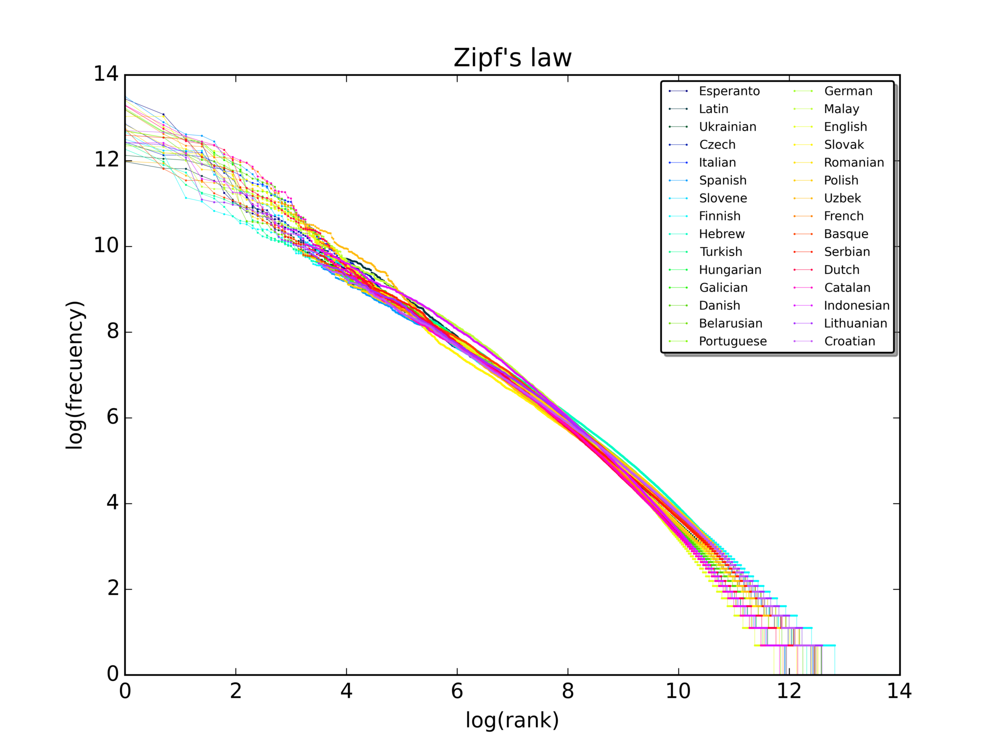

# Development and debugging

## Lexicon construction

<!--N -->

So, you've got your morphotactics more or less sorted out, and you've made a good start on your morphophonological rules. Where are you going to get the lexemes ? Depending on the language you choose you may already have a beautifully prepared list of stems. For other languages there might be a dictionary with less elaborate systems of classes, perhaps traditional ones that underspecify the morphology, or perhaps ones that don't specify the morphology at all. In the worst case you may have to just rely on a Swadesh list or a simple list of inflected forms from a corpus. 

In any case, whether you have a complete system or just a list of inflected forms, the best idea is to work adding words to the lexicon by **frequency** of appearance in whichever corpus you have. You might have easy access to a corpus, if not you can use a [Wikipedia database backup dump](https://dumps.wikimedia.org/backup-index.html) or you can write a webcrawler for some online newspaper. You can use [`WikiExtractor.py`](https://svn.code.sf.net/p/apertium/svn/trunk/apertium-tools/WikiExtractor.py) script to extract raw text from Wiki dump.


1. Download the latest version of Guaraní Wikipedia.
   - Go to [Wikipedia database backup dumps](https://dumps.wikimedia.org/backup-index.html)
   - Find the link for `gnwiki` and click on it.
   - Download the file that ends in `-pages-articles.xml.bz2`.
2. Run `WikiExtractor.py` using the following command:

```bash
$ python3 WikiExtractor.py --infn gnwiki-20191120-pages-articles.xml.bz2
```

You will get a lot of output representing the names of the articles in the Wikipedia. 

**TIP:** If you get an error like `No such file or directory`, try doing `ls *.bz2` to find the name of the file.

Now you have `wiki.txt` file, this contains all the text from Wikipedia.

We can get a frequency list using simple `bash` script:

```bash
$ cat wiki.txt | tr ' ' '\n' | sort | uniq -c | sort -nr > hitparade.txt
```

This takes the text in `wiki.txt`, applies a <u>tr</u>ansforms all spaces into newlines `\n`, then it sorts
the list and counts `-c` <u>uniq</u>ue instances. These are then sorted again by number of instances.

You can look at the first 10 lines of output like this:

```bash
$ head hitparade.txt 
  19665 ha
   6694 
   4350 peteĩ
   4299 de
   3581 umi
   3331 ha'e
   3066 avei
   2926 ary
   2293 pe
   2174 upe
```

We can find out the number of words in the frequency list:
```bash
$ wc -l hitparade.txt 
101089 hitparade.txt
```

<!-- FIXME: Nastya -->
Let's compare this output with part of speech and gloss in English. 

```
CCONJ "and"
CCONJ "and"
CCONJ "and"
PRON  "it, she, he"
ADP   "about"
NOUN  "of month"
NUM   "on the Nth"
NOUN  "zone, region"
ADV   "not"
VERB  "was"
NOUN  "year"
NOUN  "possibility"
NUM   "one"
NUM   "th"
VERB  "saying"
PRON  "it, she, he"
VERB  "happened"
```

The picture below shows a graphical representation of Zipf's law. 



As you can see the most frequent words are unsurprising for a text from a newspaper, words about time and place, closed category words like conjunctions, adpositions and pronouns and copula verbs. This was from a corpus of around 367,168 tokens, so the list won't be so representative for the language as a whole, but the bigger and more balanced the corpus the more legit the frequency list is going to be and the better it is going to represent the language that your analyser is likely to be asked to process.

## More on morphotactics 

When moving from making a morphological model of a few words from a grammar to making one that covers a whole corpus you are bound to come across some examples of things that are either underdescribed or not described at all in the extant grammars. For example, how loan words are treated and how to deal with numerals or abbreviations which take affixes according to how the words are pronounced and not how they are written.

### Loan words 
<!--N -->

Guaraní local nasalisation rules do not work for Spanish loans. Thus, we have *urũme* but *asociaciónpe*, locative does not change. How to deal with that? Introduce some archiphoneme that will "cancel" the nasalisation rule.

For example we can introduce a new lexicon `Nouns-Spa` and an archiphoneme `%{s%}`, see code below:

```
LEXICON Nouns-Spa

asociación:asociación%{s%} N ;
declaración:declaración%{s%} N ;
```
Now we can add an exception to nasalisation rule we defined earlier in `twol` file. This way the transducer will overlook the cases where the nasalisation is not needed.

```
"Surface [m] in loc affix after nasals"
%{m%}:m <=> Nas: %>: _ ;
            except
            %{s%}: %>: _ ;
```
<!-- asociaciónpe Declaraciónpe--->

### Numerals and abbreviations 
<!-- N -->

Numerals and abbreviations present a problem: they do not provide us with any information at all about how the word should be pronounced (as they are written in digits). Take a look at this following example: 

| Onohẽ           | iPod | ary  | 2001-me  | ha  | ary  | 2003-pe  | tienda online | vendeha    | puraheikuéra         | ha iTunes  |
|-----------------|------|------|----------|-----|------|----------|---------------|------------|----------------------|------------|
| 3Sg-release      | iPod | year | 2001-LOC | and | year | 2003-LOC | online shop   | sell-SUBST | song-PL              | and iTunes |
| (They) released | iPod | in   | 2001     | and | in   | 2003     | started to    | sell       | songs in online shop | and iTunes |
|                 |      |      |          |     |      |          |               |            |                      |            |

The ajacent suffix depends on the pronounciation of the final digit in the number, for example, `1` is pronounced as *peteĩ* where the final `ĩ` is nasal and `3` is pronounced as *mbohapy* where `y` is not nasal.

Thus we can have a lexicon of digits with the archiphoneme, for example,  `%{d%}` indicating whether the nasal alternation should be done or not.


Here is an excerpt from a transducer in lexc that handles numeral expressions:

```
LEXICON NUM-DIGIT

%<num%>:%- CASE ;


LEXICON LOOP

LAST-DIGIT ;
DIGITLEX ;


LEXICON LAST-DIGIT

1:1%{d%} NUM-DIGIT ; !"peteĩ"
3:3 NUM-DIGIT ; !"mbohapy"


LEXICON DIGITLEX

1:1%{d%} NUM-DIGIT ; !"peteĩ"
3:3 NUM-DIGIT ; !"mbohapy"

LEXICON DIGITLEX

%0:%0 LOOP ;
1:1   LOOP ;
2:2   LOOP ;
3:3   LOOP ;
4:4   LOOP ;
5:5   LOOP ;
6:6   LOOP ;
7:7   LOOP ;
8:8   LOOP ;
9:9   LOOP ;
```
It is not complete but it should give you enough pointers to be able to implement it.

You can add the rest of the Guaraní numerals to the lexicon:

- 2 - mokõi
- 4 - irundy
- 5 - po
- 6 - poteĩ
- 7 - pokõi
- 8 - poapy
- 9 - porundy

Note that in the `Alphabet` in your `twol` file you can specify these kind of symbols as always going to `0`:

```
Alphabet

A B Ã C D E Ẽ G G̃ H I Ĩ J K L M N Ñ O Õ P R S T U Ũ V W X Y Z Ỹ Á É Í Ó Ú Ý   F Q
a b ã c d e ẽ g g̃ h i ĩ j k l m n ñ o õ p r s t u ũ v w x y z ỹ á é í ó ú ý ʼ f q

%{m%}:p
%{m%}:m
%{d%}:0
```

This saves you writing rules to make them correspond with nothing on the surface.

Try to implement a rule that takes into account this alternation.

### Guessers 
<!-- FMT -->

## Unit testing 
<!-- FMT -->

## Evaluation
<!-- FMT -->

As with all tasks, there are various ways to evaluate morphological transducers. Two of the 
most popular are *naïve* coverage and precision and recall.


### Coverage 

The typical way to evaluate coverage as you are developing the transducer is by calculating
the *naïve* coverage. That is we calculate the percentage of tokens in our corpus
that receive at least one analysis from our morphological analyser. We can do this easily 
in `bash`, for example:

```
$ total=`cat grn.crp.txt  | sed 's/[^a-zA-Z]\+/ /g' | tr ' ' '\n'  | grep -v '^$' | wc -l`
$ unknown=`cat grn.crp.txt  | sed 's/[^a-zA-Z]\+/ /g' | tr ' ' '\n'  | grep -v '^$' | hfst-lookup -qp grn.mor.hfst  | grep 'inf' | wc -l`
$ echo "(($total-$unknown)/$total)*100" | bc -l
	~0.12990425758725153332
```

 So our current Guaraní analyser has a coverage of 0.12%... not very impressive yet!

Note: If your coverage is different from the number you see here, do not worry, so long as it is around the same (to within 5%) it's probably just an effect of having different versions of the same corpus.

Alternatively it would be possible to write a Python script. A good rule of thumb is that given an an average sized corpus (under one million tokens) for averagely inflected language (from English to Finnish) 500 of the most frequent stems should get you around 50% coverage, 1,000 should get you around 70% coverage, and 10,000 should get you around 80% coverage. Getting 90% coverage will mean adding around 20,000 stems. 

<!-- MORE -->


### Precision and recall 


The second way is to calculate precision, recall and F-measure like with other NLP tasks. To calculate
this you need a *gold standard*, that is a collection of words annotated by a linguist and 
native speaker which contain all and only the valid analyses of the word. Given the gold standard, 
we can calculate the precision and recall as follows:
* Precision, *P* = number of analyses which were found in both the output from the morphological analyser and the gold standard, divided by the tot
al number of analyses output by the morphological analyser
* Recall, *R* = number of analyses found in both the output from the morphological analyser and the gold standard, divided by the number of analyse
s found in the morphological analyser plus the number of analyses found in the gold standard but not in the morphological analyser. 

Thus, suppose we had the following:


<!-- MORE -->

There is a script <a href="https://ftyers.github.io/2017-КЛ_МКЛ/scripts/evaluate-morph.py">evaluate-morph</a> that will calculate precision, recall
and F-score for output from an analyser for a set of surface forms.

As these kind of collections are hard to come by &mdash; they require careful hand annotation &mdash; 
some people resort to producing a *pseudo-*gold standard using an annotated corpus. However,
note that this may not contain all of the possible analyses so may misjudge the quality of the analyser 
by penalising or not giving credit to analyses which are possible but not found in the corpus.

In all cases a random sample of surface forms should be used to ensure coverage of cases from across the frequency range.

## Generating paradigms 
<!-- FMT -->

A finite-state transducer can be used in addition to produce either paradigm tables or all the forms 
of a given word.  First we produce a transducer which accepts the stem we are interested in plus
the lexical category and any number of other tags, `?*`:

```
$ echo "i r ũ %<n%> ?*" | hfst-regexp2fst -o irũ.hfst
```

Then we compose intersect the whole morphological generator with this transducer to find only those 
paths which start with that prefix:

```

```

This is less useful than it may appear because it also produces all of the derived 
forms. If we want to just include the inflected forms we can just list the forms we want to 
generate for a given part of speech in a file, for example:

```
$ cat noun-paradigm.txt 
%<n%> %<nom%>
%<n%> %<gen%>
%<n%> %<ins%>
%<n%> %<pl%> %<gen%>
%<n%> %<pl%> %<nom%>
%<n%> %<pl%> %<ins%>
```
Then compile this file into a transducer in the same way:

```
$ cat noun-paradigm.txt | sed "s/^/i r ũ /g"  | hfst-regexp2fst -j > irũ.hfst 
```

Then finally compose and intersect with our transducer:

```
$ hfst-compose-intersect -2 grn.gen.hfst -1 irũ.hfst | hfst-fst2strings 

```
This kind of full-form paradigm is useful for debugging, and also for generating 
training data for fancy machine-learningy type things. It can also help with 
low-resource dependency parsing (systems like <a href="https://github.com/ufal/udpipe">UDpipe</a> allow
the use of external dictionaries at training time).


## Segmenters

<!-- FMT -->
